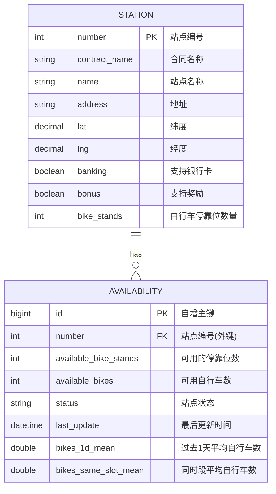
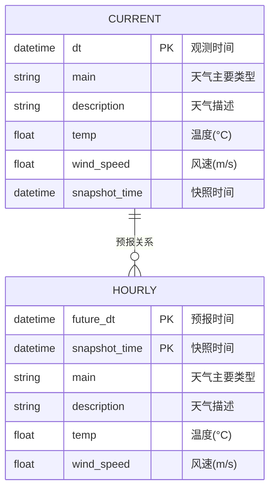
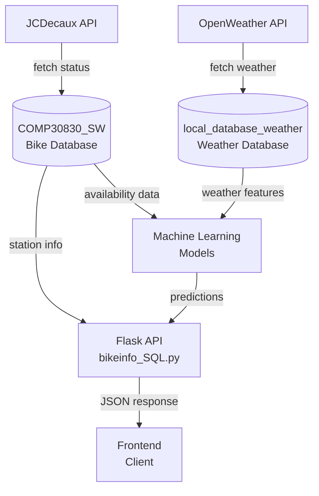

# 数据库 UML 结构

## 数据库概览

项目包含两个主要数据库：
1. **COMP30830_SW** - 自行车共享系统数据库
2. **local_database_weather** - 天气数据库

---

## 1. Bike 数据库 (COMP30830_SW)

### 表关系图



### 表结构详情

#### station (车站表)
| 字段名 | 数据类型 | 约束 | 说明 |
|------|--------|------|------|
| number | INT | PK | 站点编号 |
| contract_name | VARCHAR(64) | | 合同名称 |
| name | VARCHAR(128) | | 站点名称 |
| address | VARCHAR(256) | | 地址 |
| lat | DECIMAL(9,6) | | 纬度坐标 |
| lng | DECIMAL(9,6) | | 经度坐标 |
| banking | BOOLEAN | | 是否支持银行卡 |
| bonus | BOOLEAN | | 是否支持奖励 |
| bike_stands | INT | | 停靠位总数 |

#### availability (可用性表)
| 字段名 | 数据类型 | 约束 | 说明 |
|------|--------|------|------|
| id | BIGINT | PK, AI | 自增主键 |
| number | INT | FK | 指向station.number |
| available_bike_stands | INT | | 可用停靠位数 |
| available_bikes | INT | | 可用自行车数 |
| status | VARCHAR(16) | | 站点状态 |
| last_update | DATETIME | | 最后更新时间 |
| bikes_1d_mean | DOUBLE | NULL | 过去24小时平均自行车数 |
| bikes_same_slot_mean | DOUBLE | NULL | 同时段的平均自行车数 |

**索引**：
- `UNIQUE INDEX uq_availability_number_last_update` on (number, last_update) - 用于去重

**外键关系**：
- `CONSTRAINT fk_station_number` FOREIGN KEY (number) REFERENCES station(number) ON DELETE CASCADE

---

## 2. 天气数据库 (local_database_weather)

### 表关系图



### 表结构详情

#### current (当前天气表)
| 字段名 | 数据类型 | 约束 | 说明 |
|------|--------|------|------|
| dt | DATETIME | PK | 观测时间 |
| main | VARCHAR(256) | | 天气主要类型 (如: Clouds, Rain) |
| description | VARCHAR(256) | | 详细天气描述 |
| temp | FLOAT | | 温度(摄氏度) |
| wind_speed | FLOAT | | 风速(m/s) |
| snapshot_time | DATETIME | | 数据快照时间 |

#### hourly (小时天气预报表)
| 字段名 | 数据类型 | 约束 | 说明 |
|------|--------|------|------|
| future_dt | DATETIME | PK | 预报时间 |
| snapshot_time | DATETIME | PK | 快照时间 |
| main | VARCHAR(256) | | 天气主要类型 |
| description | VARCHAR(256) | | 详细天气描述 |
| temp | FLOAT | | 预报温度(摄氏度) |
| wind_speed | FLOAT | | 预报风速(m/s) |

---

## 3. 数据流与使用关系



---

## 4. 关键数据特性

### Bike 数据库
- **更新频率**: 每 10 分钟 (144 次/天)
- **数据保留**: 7 天滚动窗口 (1008 个采样间隔/周)
- **机器学习特征**:
  - `bikes_1d_mean`: 最近 144 个数据点的平均值 (滚动窗口)
  - `bikes_same_slot_mean`: 同一小时的历史平均值 (最少 3 个数据点)

### 天气数据库
- **Current 表**: 实时天气观测数据
- **Hourly 表**: 小时级别的天气预报数据
- **字符编码**: UTF8MB4 (支持多语言)

---

## 5. 数据库访问层

### Bike 数据库操作
- `get_stations_sql()` - 获取所有车站信息
- `get_availability_sql()` - 获取所有可用性数据
- `get_station_sql(station_id)` - 获取特定车站的最新数据
- `get_station_history_sql(station_id)` - 获取车站的时间序列数据
- `get_prediction_db_features(station_id, target_time)` - 获取机器学习特征

### 数据导入流程
1. **JSON 导入** (`cell03_import_json_to_database.py`) - 从本地 JSON 文件导入历史数据
2. **API 导入** (`cell04_import_api_to_database.py`) - 从 JCDecaux API 定期拉取实时数据

---

## 6. 部署配置

### 数据库连接信息
- **驱动**: MySQL + PyMySQL
- **字符集**: UTF8MB4
- **配置文件**: `config.py` (存储凭证和连接参数)
  - `DB_USER` - 数据库用户
  - `DB_PASSWORD` - 数据库密码
  - `DB_HOST` - 数据库主机地址
  - `DB_PORT` - 数据库端口(默认 3306)
  - `DB_NAME` - 数据库名称

---

## 7. 数据流详解：什么地方写入、什么地方调用

### 7.1 数据写入流程（3个入口）

#### 入口1: 历史数据导入
- **文件**: [cell03_import_json_to_database.py](../../bikeinfo/bikeapi_cells/cell03_import_json_to_database.py)
- **数据源**: 本地 JSON 文件
- **方式**: 一次性运行

#### 入口2: 定时API拉取（主通道）
- **文件**: [cell04_import_api_to_database.py](../../bikeinfo/bikeapi_cells/cell04_import_api_to_database.py)
- **数据源**: JCDecaux API
- **频率**: 每5分钟
- **操作**: 下载 → 解析 → 计算特征 → 清理过期数据 → 写入DB

#### 入口3: 手动快照保存
- **文件**: [bikeinfo_SQL.py](../../flaskapi/bikeinfo_SQL.py) 中的 `save_snapshot()`
- **触发**: `/stations/refresh` 端点
- **用途**: 备用方案

---

### 7.2 数据读取流程（应用程序调用）

#### 读取来源：Flask 后端
- **文件**: [bikeinfo_SQL.py](../../flaskapi/bikeinfo_SQL.py) - 7个查询函数
- **函数**:
  - `get_stations_sql()` - 所有站点
  - `get_station_sql(id)` - 特定站点最新状态
  - `get_station_history_sql(id)` - 历史时间序列
  - `get_prediction_db_features(id, time)` - ML特征
  - `get_availability_sql()` - 所有可用性数据

#### API 端点：[app.py](../../flaskapi/app.py)
| 端点 | 功能 |
|-----|------|
| `/stations` | 所有站点+最新数据 |
| `/stations_SQL/<id>/info` | 站点详细信息 |
| `/station/<id>/history` | 历史趋势 |
| `/predict` | 骑行需求预测 |

#### 消费方
1. **前端**: 地图和UI显示
2. **ML模型**: 特征输入 → 预测输出
3. **Jupyter分析**: 数据统计报表

---

### 7.3 数据流全景图

```
┌─────────────────────────────────────────────────────────────┐
│                        写入流程 (INPUT)                        │
└─────────────────────────────────────────────────────────────┘

┌─────────────────────────────────────────────────────────────┐
│ JCDecaux API                                                 │
│ (实时自行车站状态)                                              │
└─────────────────┬──────────────────────────────────────────┘
                  │ 每5分钟拉取一次
                  ↓
        ┌─────────────────────────┐
        │ cell04_import_api_to_db │  文件位置:
        │ - 下载数据               │  bikeinfo/bikeapi_cells/
        │ - 解析 JSON              │  cell04_import_api_to_database.py
        │ - 计算特征               │
        │ - 清理过期数据           │
        └─────────────────────────┘
                  │
                  ↓ (INSERT/UPDATE)
        ┌─────────────────────────────────────────────┐
        │  COMP30830_SW 数据库                        │
        ├──────┬──────────────┬──────────────────────┤
        │station│availability │ (+ 索引、外键)       │
        │(静态) │(时间序列)    │                     │
        └──────┴──────────────┴──────────────────────┘
                  ↑
                  │ (SELECT)
                  
┌─────────────────────────────────────────────────────────────┐
│              读取流程 (OUTPUT / 应用)                          │
└─────────────────────────────────────────────────────────────┘

        ┌──────────────────────────────────┐
        │   bikeinfo_SQL.py                │  文件位置:
        │   - 数据库访问层 (Data Access)   │  flaskapi/bikeinfo_SQL.py
        │   - 7 个查询函数                  │
        └──────┬───────────────────────────┘
               │
       ┌───────┼────────────┐
       ↓       ↓            ↓
  ┌────────┐ ┌────────┐ ┌───────────┐
  │ Flask  │ │   ML   │ │  Analytics│
  │ API    │ │ Models │ │  Reports  │
  │(app.py)│ │(.py)   │ │ (Jupyter) │
  └────┬───┘ └───┬────┘ └─────┬─────┘
       │         │           │
       ↓         ↓           ↓
    ┌──────────────────────────────┐
    │       前端客户端 (Frontend)   │
    │  - 地图展示 站点位置          │
    │  - 显示 自行车/停靠位可用数   │
    │  - 预测 未来可用数量          │
    │  - 历史 趋势图表              │
    └──────────────────────────────┘
```

---

## 8. 各模块的具体功能说明

### 8.1 数据库设计思路

#### 为什么使用两个表（station + availability）？

| 考虑 | 说明 |
|-----|------|
| **设计模式** | 规范化设计（1NF, 2NF, 3NF） - 减少数据冗余 |
| **station 表** | 存储**静态数据**（位置、地址等不常变的信息） |
| **availability 表** | 存储**动态数据**（每 5 分钟更新的实时状态） |
| **分离好处** | ① 减少 station 表的频繁更新<br/>② 提高 availability 查询性能<br/>③ 便于时间序列分析（availability 表可随意删除过期数据） |
| **外键关系** | `availability.number → station.number` 保证数据一致性 |
| **索引设计** | `UNIQUE(number, last_update)` 防止重复记录 |

#### 为什么添加 bikes_1d_mean 和 bikes_same_slot_mean？

| 列名 | 用途 | 计算逻辑 | 应用场景 |
|-----|------|--------|--------|
| `bikes_1d_mean` | ML 特征工程 | 最近 144 个采样点（24小时）的平均 | 预测模型输入 |
| `bikes_same_slot_mean` | 季节特征 | 历史同一小时的平均（≥3 个样本） | 反映特定时间的习惯 |

### 8.2 核心流程简化说明

#### 流程A: 数据采集（每5分钟）
```
API 拉取 (1500站点) → 解析 → 计算特征 (bikes_1d_mean, bikes_same_slot_mean)
                   → 清理过期数据 (>7天) → 写入 MySQL
```

#### 流程B: 前端展示
```
GET /stations → Flask → bikeinfo_SQL.py → SELECT station + availability
            → JSON → 地图渲染 (1500个标记)
```

#### 流程C: 预测骑行需求
```
GET /predict?station_id=2001&date=2024-01-15&time=14:30
→ 获取 DB特征 (bikes_1d_mean, bikes_same_slot_mean)
→ 获取 天气数据 (temp, wind_speed)
→ 构建特征向量 → ML模型 → 预测结果 (available_bikes)
```

#### 流程D: 数据分析
```
Jupyter → SQL 查询 → 统计计数、时间线、分布 → 可视化报表
```

---

## 9. 数据库规模与性能考虑

### 数据量估算

| 参数 | 值 | 说明 |
|-----|-----|------|
| 站点数量 | 1,500 | JCDecaux Dublin network |
| 采样频率 | 每 5 分钟 | 144 次/天 |
| 数据保留 | 7 天 | 1,008 采样/站点 |
| **总记录数** | **~1.5M** | 1500 × 1008 = 1,512,000 |
| 磁盘占用 | ~150-200 MB | availability 表为主 |
| 查询性能 | <50ms | 索引优化后 |

### 查询性能优化

| 操作 | 索引类型 | 原因 |
|-----|--------|------|
| `SELECT * FROM station WHERE number = 123` | PK (number) | 快速定位站点 |
| `SELECT COUNT(*) FROM availability WHERE number = 123` | FK (number) | 快速关联查询 |
| `SELECT * FROM availability WHERE number = 123 AND last_update > ? ORDER BY last_update` | UNIQUE(number, last_update) | 范围查询优化 |

---

## 10. 故障排查指南

### 当前端显示为空的原因排查

```python
# 检查 1: 数据库有数据吗？
SELECT COUNT(*) FROM station;          # 应该 > 0
SELECT COUNT(*) FROM availability;     # 应该 > 0

# 检查 2: 连接字符串是否正确？
# 验证 config.py 中的 DB_HOST, DB_USER, DB_PASSWORD

# 检查 3: 导入脚本是否在运行？
ps aux | grep cell04_import_api_to_database.py

# 检查 4: API 是否可用？
curl https://api.jcdecaux.com/v1/stations?contract=Dublin&apikey=YOUR_KEY

# 检查 5: 最后一次数据更新时间？
SELECT MAX(last_update) FROM availability;
```

### 常见问题

| 问题 | 原因 | 解决方案 |
|-----|------|--------|
| "No routes to host" | DB 连接失败 | 检查 MySQL 服务和防火墙 |
| 数据不更新 | 导入脚本未运行 | 启动 cell04 脚本，使用 `nohup` 后台运行 |
| 预测结果为 NaN | 特征数据不足 | 需要至少 72 小时历史数据 |
| 查询超时 | 缺少索引 | 运行 `CREATE INDEX uq_availability_number_last_update` |

